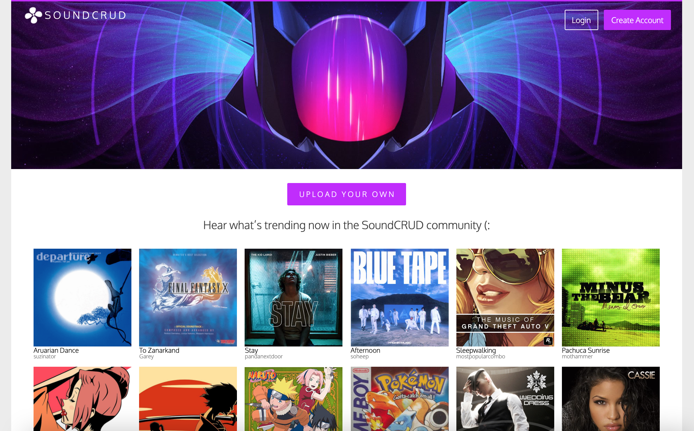
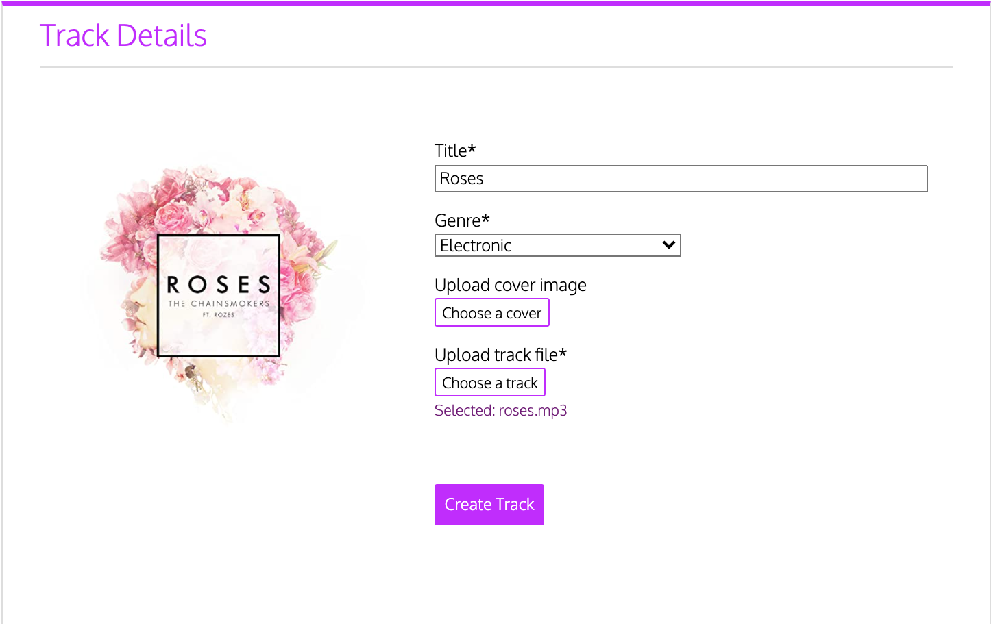
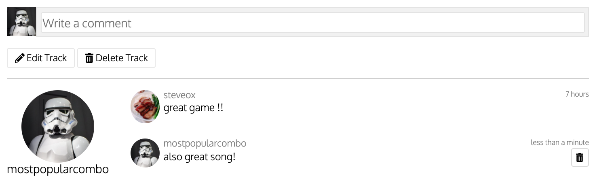

# soundCRUD

**Due to hosting issues, the live site is no longer available.**

soundCRUD is a clone of SoundCloud in which users can upload and share music tracks with others. Users can browse through tracks uploaded by the rest of the community and can comment and listen to each track.

</img>

# Technologies Used
* Backend
  * Ruby on Rails
  * PostgreSQL
* Frontend
  * React
  * Redux
  * AWS

# Features
## Continuous Audio Play

Users can play tracks that will not be interrupted with page navigation and/or component rendering as long as they remain logged in. This is accomplished by rendering the MusicPlayerComponent in a protected route and by persisting the current track playing in a state nested under the ui state.

```javascript
//frontend/components/app.jsx
<ProtectedRoute path="/" component={MusicPlayerContainer} />
```
```javascript
// frontend/components/music_player/music_player_container.jsx
const mSTP = state => ({
    track: state.ui.player.currentTrack
});

const mDTP = dispatch => ({
    receivePlayTrack: track => dispatch(receivePlayTrack(track)),
    clearPlayTrack: () => dispatch(clearPlayTrack())
});
```

## Uploading Tracks

Users can upload their own tracks as long as they provide a title, genre, and track file. If no cover image is provided by the user, a default one will be assigned to that track. Users can edit their tracks and upload a cover image at a later time if they wish.

</img>

## Creating Comments

Users can leave timestamped comments for any track. All comments for that track will render on its page and users will have ability to delete their own comments.

</img>

## Future Features
* Track visualizers 
* Playlists
